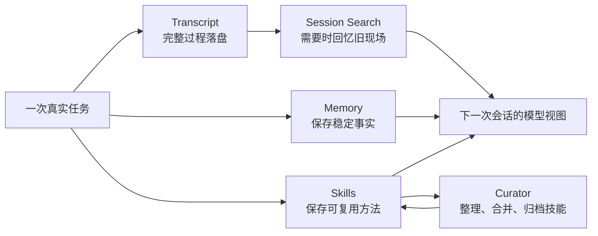

# Hermes Agent 源码阅读路线：从自进化闭环开始

如果只用一句话概括 Hermes Agent 的亮点，它不是“工具很多”，也不是“能接很多聊天平台”，而是：它试图把一次任务里的经验，变成下一次任务开始前就已经存在的能力。

这就是 Hermes README 里强调的 closed learning loop。它会把用户偏好写进 memory，把可复用流程沉淀成 skills，把旧会话留在 session_search 里，把复杂任务后的复盘放到后台 review 里，再用 curator 管住越长越大的技能库。

所以这一组文章不从“它支持哪些功能”开始，而从一个更核心的问题开始：

> 一个 Agent 怎么才算真的会成长？

## 先给一张总图

Hermes 的自进化不是一个单独模块，而是一条链路：

这张图里有三个东西最容易混在一起：

| 载体 | 记什么 | 什么时候用 | 典型源码 |
| --- | --- | --- | --- |
| Memory | 稳定事实、用户偏好、环境约定 | 每个新会话启动时注入模型视图 | [`tools/memory_tool.py`](https://github.com/NousResearch/hermes-agent/blob/3edd09a46/tools/memory_tool.py) |
| Skills | 可复用流程、踩坑经验、操作步骤 | 需要某类任务能力时按需加载 | [`tools/skills_tool.py`](https://github.com/NousResearch/hermes-agent/blob/3edd09a46/tools/skills_tool.py)、[`tools/skill_manager_tool.py`](https://github.com/NousResearch/hermes-agent/blob/3edd09a46/tools/skill_manager_tool.py) |
| Session Search | 历史现场、上下文证据、旧任务细节 | 用户提到过去的事，或模型怀疑旧上下文有价值时搜索 | [`tools/session_search_tool.py`](https://github.com/NousResearch/hermes-agent/blob/3edd09a46/tools/session_search_tool.py)、[`hermes_state.py`](https://github.com/NousResearch/hermes-agent/blob/3edd09a46/hermes_state.py) |

如果这三个边界不清楚，读 Hermes 会很乱。比如“用户喜欢短回答”适合进 memory；“做 GitHub PR review 的步骤”适合进 skill；“上周那个 PR 的编号和当时的报错”应该留在 transcript 里，通过 session_search 找回来。

## 系列怎么读

建议按下面顺序读。每篇只解决一个主问题，不抢下一篇的内容。

1. [自进化闭环：Hermes 为什么不只是工具调用器](./01-learning-loop.md)
   先从宏观理解 Hermes 的核心卖点：一次任务结束后，经验怎样变成下一次任务的输入。

2. [Memory：事实为什么要短、稳、慢注入](./02-memory.md)
   解释 `MEMORY.md` / `USER.md`、frozen snapshot、写入审批、prompt cache 稳定性。

3. [Skills：把一次成功变成下次可复用的方法](./03-skills.md)
   解释 skills 的 progressive disclosure、`skill_manage`、后台复盘、curator。

4. [Session Search：长期记忆不等于把历史全塞进上下文](./04-session-search.md)
   解释 SQLite、FTS5、CJK trigram、discovery / scroll / browse 三种搜索形态。

5. [运行时触发点：自进化是怎么挂进主循环的](./05-runtime-triggers.md)
   从 `prompt_builder`、`turn_context`、`conversation_loop`、`turn_finalizer` 追一遍触发链路。

6. [总结与追问：从宏观到微观讲清 Hermes Agent](./06-summary-and-questions.md)
   把前面几篇压缩成不同层次的复述版本，并列出值得继续追问的问题。

## 读源码时抓哪条主线

不要先问“它有哪些工具”。先问这四个问题：

1. 这次任务产生了什么经验？
2. 这些经验应该进入 memory、skills，还是只留在 transcript？
3. Hermes 在什么时候决定要复盘？
4. 如果复盘写错了，系统有没有治理手段？

Hermes 的特别之处就在这里：它不是简单地把上下文越堆越长，而是把不同类型的经验放进不同的长期载体里。

这也是后面每篇文章的共同主线：先看问题，再看 Hermes 为什么引入这个模块，最后再看源码如何约束这个模块不要失控。
