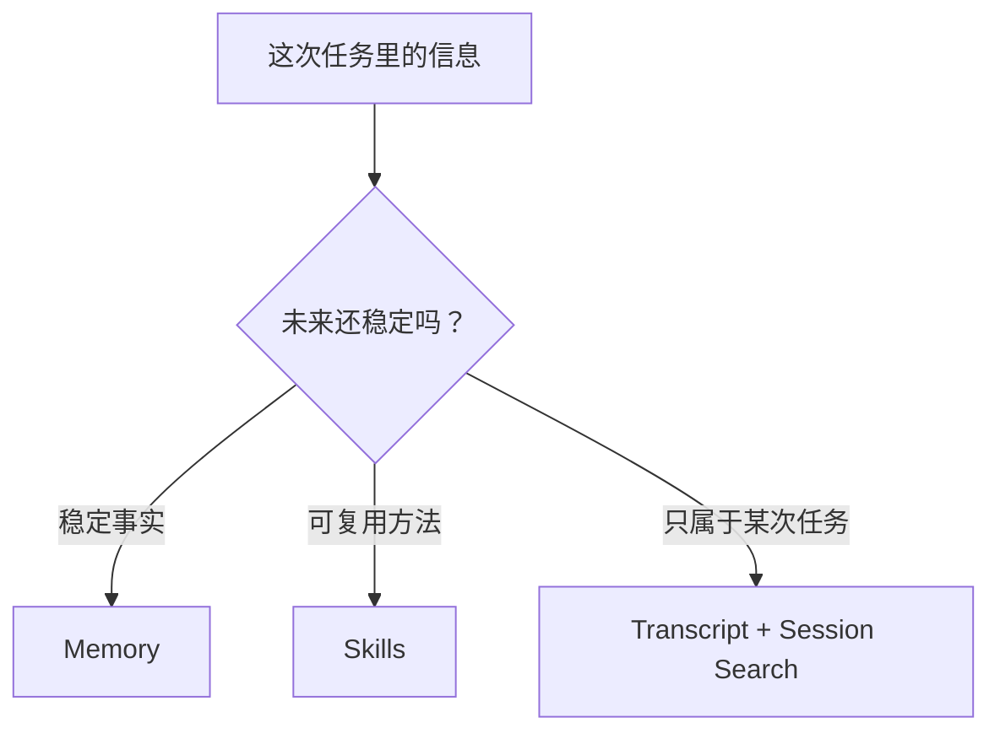

# 自进化闭环：Hermes 为什么不只是工具调用器

很多 Agent 项目都会说自己能用工具。它能读文件、跑命令、查网页、调用 API，于是看起来已经很强。

但这只能说明它“这一轮能做事”。真正困难的问题是：这次做事留下的经验，下一次还在不在？

如果下一次还要用户重新解释偏好、重新提醒坑点、重新描述工作流，那么它只是一个强一点的会话界面。Hermes 想做的是另一件事：把经验分门别类地留下来，让下一次会话一开始就站在更高的位置上。

## 先区分两种能力

Agent 的能力大致可以分成两类。

第一类是即时能力：模型会推理，工具能执行，网关能收消息，终端能跑命令。这类能力解决的是“现在怎么完成任务”。

第二类是成长能力：这次任务里学到的偏好、方法、坑点、上下文，能否在未来被正确取回。这类能力解决的是“下次怎样少走弯路”。

Hermes 的亮点在第二类。

它的 README 直接把自己定位成 self-improving agent，并把闭环拆成几个动作：从经验创建 skills，在使用中改进 skills，主动持久化知识，搜索过去的会话，跨会话理解用户。这不是一个营销句式，源码里确实有对应链路。

## 一次任务结束后发生什么

先不要急着看 memory 或 skills 的实现。先看一轮任务的生命周期。

在主循环里，模型正常完成用户任务。过程中会产生很多痕迹：用户消息、模型回复、工具调用、工具结果、错误、重试、最后的回答。这些会进入 session transcript。

任务结束后，Hermes 不会立刻把全部历史塞进下次 prompt。它会先判断：这轮是否到了复盘时机。

触发点有两个：

- memory 复盘按用户轮次计数，默认每 10 个用户 turn 检查一次。
- skills 复盘按工具迭代计数，默认每 10 次工具循环检查一次。

初始化位置在 [`agent/agent_init.py`](https://github.com/NousResearch/hermes-agent/blob/3edd09a46/agent/agent_init.py)，默认值分别是 `_memory_nudge_interval = 10` 和 `_skill_nudge_interval = 10`。用户每发一轮消息，[`agent/turn_context.py`](https://github.com/NousResearch/hermes-agent/blob/3edd09a46/agent/turn_context.py) 会推进 memory 计数。模型每进入一次工具循环，[`agent/conversation_loop.py`](https://github.com/NousResearch/hermes-agent/blob/3edd09a46/agent/conversation_loop.py) 会推进 skill 计数。

真正启动复盘的地方在 [`agent/turn_finalizer.py`](https://github.com/NousResearch/hermes-agent/blob/3edd09a46/agent/turn_finalizer.py)：只有当本轮有最终回答、没有被中断，并且 memory 或 skills 的触发条件满足时，Hermes 才会调用 `_spawn_background_review()`。

这一步很关键。自进化不是在用户等回答的时候抢上下文，而是在回答交付之后后台进行。

## 为什么要后台复盘

如果把“要不要保存经验”放进主任务里，模型就会同时做两件事：

1. 完成用户眼前的任务。
2. 判断自己是否应该写 memory 或 skill。

这很容易污染任务路径。比如用户只是想让它修一个 bug，模型却花大量 token 总结经验；或者为了写 skill，它提前改变了回答节奏。

Hermes 的做法是把复盘放到后台 review fork 里。[`agent/background_review.py`](https://github.com/NousResearch/hermes-agent/blob/3edd09a46/agent/background_review.py) 会创建一个新的 `AIAgent`，继承父 agent 的 provider、model、base_url、api_key、credential pool、session_id、cached system prompt，然后把当前消息快照交给这个 review agent。

这个 fork 只允许做两类事：

- 调用 memory 工具。
- 调用 skills 管理工具。

其他工具会被 whitelist 拦住。也就是说，后台复盘不是另一个可以随便操作系统的 agent，它只是一个负责判断“哪些经验值得留下”的旁路流程。

## 复盘到底写到哪里

复盘之后有三个去处。

第一个是 memory。它适合保存稳定事实，比如用户偏好、环境约定、项目习惯。对应工具是 [`tools/memory_tool.py`](https://github.com/NousResearch/hermes-agent/blob/3edd09a46/tools/memory_tool.py)。

第二个是 skills。它适合保存“怎么做一类任务”的流程，比如某类调试方法、某个平台接入步骤、某种审查清单。对应工具是 [`tools/skill_manager_tool.py`](https://github.com/NousResearch/hermes-agent/blob/3edd09a46/tools/skill_manager_tool.py)。

第三个是 transcript。它不是主动写出来的“经验”，而是完整过程本来就会落盘。以后如果需要查过去发生过什么，可以走 [`tools/session_search_tool.py`](https://github.com/NousResearch/hermes-agent/blob/3edd09a46/tools/session_search_tool.py)。

这三个去处的边界非常重要：

比如：

- “用户偏好简洁回答”是 memory。
- “修复某类 provider 鉴权问题的步骤”是 skill。
- “今天这个 PR 的编号、commit SHA、临时日志”是 transcript。

如果都塞进 memory，memory 会污染未来每一轮。如果都塞进 skill，技能库会变成大量一次性碎片。如果都只留在 transcript，下一次又很难主动变好。

Hermes 的自进化，首先就是这个分类能力。

## 为什么不是每轮都写

一个看似自然的方案是：每轮结束都让模型总结一下，然后写 memory 或 skill。

Hermes 没这么做，原因很实际。

第一，写得太勤会让噪声增加。大多数会话没有产生可复用经验，强行写只会产生“今天做了什么”这类很快过期的内容。

第二，写入会影响长期行为。memory 会进入后续模型视图，skill 会影响未来同类任务。如果一次错误复盘被持久化，后面可能反复放大。

第三，主会话要保护 prompt cache。Hermes 的 memory 文件在 session start 时形成 frozen snapshot，中途写入磁盘但不改写当前 system prompt。这样经验能落盘，当前会话的稳定前缀也不被打破。

所以 Hermes 选择的是“周期性触发 + 后台判断 + 受控写入”。

## 自进化也需要治理

只要 agent 能自己写长期资产，就会有风险：它可能记错事实，可能把一次临时失败写成永久规则，可能把技能库写成一堆狭窄碎片。

Hermes 对这个问题不是靠一句“模型会判断”，而是加了几层治理。

第一层是 write approval。[`tools/write_approval.py`](https://github.com/NousResearch/hermes-agent/blob/3edd09a46/tools/write_approval.py) 支持对 memory 和 skills 的写入做审批。开启后，后台写入会先进入 pending 目录，用户可以通过 `/memory pending` 或 `/skills pending` 审核。

第二层是 skill provenance。只有后台 review 创建的 skill 才会被标为 agent-created。这样 curator 知道哪些技能可以自动维护，哪些是用户手写或外部安装的资产。

第三层是 curator。[`agent/curator.py`](https://github.com/NousResearch/hermes-agent/blob/3edd09a46/agent/curator.py) 会周期性整理 agent-created skills，把长期不用的技能标为 stale 或归档，把过窄的技能合并到更大的 umbrella skill 里。它不会自动删除，只做可恢复的归档。

这三层说明 Hermes 对自进化的态度很清醒：成长不是越写越多，而是有边界地留下、复用和整理。

## 这一篇怎么收束

如果要从宏观到微观介绍 Hermes，可以这样说：

Hermes Agent 的核心亮点是闭环学习。它不是只在当前上下文里完成任务，而是把任务经验分成三类长期资产：稳定事实进入 memory，可复用流程进入 skills，完整历史进入 SQLite transcript 并通过 session_search 检索。运行时通过 turn 和 tool-iteration 计数触发后台 review，review fork 继承父 agent 的运行时和 cached system prompt，但只允许调用 memory 和 skill 管理工具。写入可以走 approval gate，技能库还有 curator 做 stale、archive、consolidation，避免自进化变成无限膨胀。

这段话里有三层：

- 宏观：Hermes 是 self-improving agent，不只是工具调用器。
- 中观：memory / skills / session_search 分别承担不同类型的长期经验。
- 微观：触发点在 `turn_context`、`conversation_loop`、`turn_finalizer`，后台逻辑在 `background_review`，治理在 `write_approval` 和 `curator`。

下一篇进入 memory。因为在自进化系统里，最容易出问题的不是“忘了记”，而是“记错了、记多了、记成了未来每轮都要执行的自我约束”。
