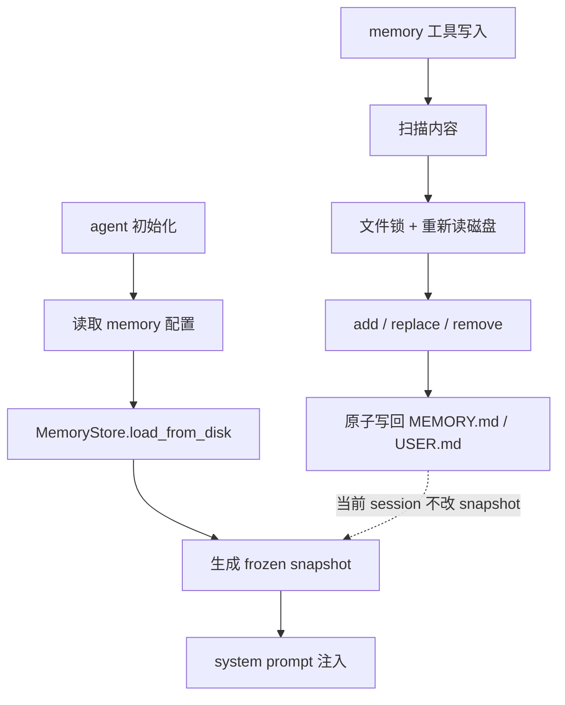

# Memory：事实为什么要短、稳、慢注入

自进化的第一步，通常会被理解成“让 Agent 记住东西”。

但真正难的不是记住，而是决定什么值得记、以什么形态记、什么时候进入模型视图。

Hermes 的 memory 设计很克制。它不是一个无限增长的知识库，而是两个有大小上限的 Markdown 文件：`MEMORY.md` 和 `USER.md`。源码在 [`tools/memory_tool.py`](https://github.com/NousResearch/hermes-agent/blob/3edd09a46/tools/memory_tool.py)。

## 先看边界：memory 不负责保存历史

Hermes 对 memory 的定位很明确：保存未来仍然稳定的事实。

适合进入 memory 的内容包括：

- 用户偏好，比如回答风格、常用语言、工作习惯。
- 环境约定，比如项目使用的测试命令、固定目录结构。
- 工具坑点，比如某个 provider 的配置方式、某个平台的限制。
- 长期仍然有价值的事实。

不适合进入 memory 的内容包括：

- 某个任务做到哪一步。
- 某个 PR 的编号。
- 某次修复的 commit SHA。
- 今天的临时日志。
- 一周后就可能过期的状态。

这些信息不是没价值，而是不应该进入每一轮模型视图。它们应该留在 transcript 里，未来通过 session_search 找回来。

这就是 Hermes 的第一层边界：memory 不是历史仓库，而是稳定事实层。

## 两个文件：一个记环境，一个记用户

`MemoryStore` 里有两份状态：

- `MEMORY.md`：agent 对环境、项目、工具、约定的长期观察。
- `USER.md`：agent 对用户偏好、身份、沟通方式的长期理解。

这两个文件都在 profile-scoped 的 memories 目录里。它们不是数据库表，而是带分隔符的 Markdown 条目。每条 entry 用 `§` 分隔。

为什么不用普通追加日志？

因为 memory 会进入 system prompt。它不是给人看的历史记录，而是给模型下一次决策用的“长期事实”。如果这里变成日志，模型每轮都会读到大量过期信息。

所以 Hermes 给 memory 加了字符上限。默认 `MEMORY.md` 大约 2200 chars，`USER.md` 大约 1375 chars。这个限制看起来小，但正是它逼着 memory 保持高密度。

## 最关键的设计：frozen snapshot

Memory 最值得看的不是 `add`、`replace`、`remove`，而是它进入 prompt 的方式。

`MemoryStore.load_from_disk()` 会做两件事：

1. 从磁盘读取 `MEMORY.md` 和 `USER.md`。
2. 构造 `_system_prompt_snapshot`。

这个 snapshot 是冻结的。当前 session 中，memory 工具继续写磁盘，但不会立刻改写这一轮 session 的 system prompt。

这听起来反直觉：既然记住了，为什么不马上让模型读到？

原因是 prompt cache。

长期会话里，system prompt 是最重要的稳定前缀。如果每次 memory 写入都改 system prompt，那么同一个会话的模型视图会不断抖动，缓存命中率会下降，甚至可能让模型在一轮任务中突然被新的长期事实影响。

Hermes 的取舍是：

- 写入要立刻落盘，避免丢。
- 当前 session 的模型前缀不变，保护缓存和行为稳定。
- 下一次 session start 再刷新 memory snapshot。

也就是说，memory 的写入是即时持久化，但进入模型视图是慢半拍的。

## 为什么要扫描和阻断

Memory 会进入 system prompt，所以它比普通文件危险。

如果 memory 里出现 prompt injection、外泄诱导、伪造系统规则，下一次 session 一启动，模型就会把它当成高优先级上下文读进去。

Hermes 因此在两个时刻做扫描：

- 写入前，`add` / `replace` 会调用 `_scan_memory_content()`。
- 加载 snapshot 时，`_sanitize_entries_for_snapshot()` 会把命中的条目替换成 `[BLOCKED: ...]` 占位。

这里的细节很重要：被阻断的原文不会从 live state 里静默消失。用户仍然可以通过 `memory(action=read)` 看到并删除它。这样既避免 prompt 被污染，也避免安全问题被藏起来。

## 为什么写入前要重新读磁盘

Memory 文件可能不只被一个 agent 写。

可能有另一个 session 正在写，也可能用户手动改过，也可能其他工具改过。Hermes 在写入前会拿文件锁，并重新从磁盘读最新内容。

如果发现文件不能按 memory 工具的格式 round-trip，或者某个条目大到超过整个 store 的字符上限，`MemoryStore` 会认为出现 external drift。它会先备份 `.bak.<ts>`，然后拒绝本次写入。

这不是吹毛求疵。因为 memory 工具最终会把 entries 重新序列化。如果磁盘上混入了自由格式内容，直接写回可能把用户手动追加的内容覆盖掉。拒绝写入，是为了避免 silent data loss。

## 写入审批：自进化不能默认全信

Hermes 允许 memory 自主写入，但也提供 write approval。

逻辑在 [`tools/write_approval.py`](https://github.com/NousResearch/hermes-agent/blob/3edd09a46/tools/write_approval.py)。开启 `memory.write_approval` 后：

- 前台 CLI 的小 memory 写入可以 inline 审核。
- gateway 或 background review 里的写入会进入 pending store。
- 用户再通过 `/memory pending`、`/memory approve`、`/memory reject` 处理。

这个设计说明 Hermes 并不把“自进化”理解成 agent 想写什么就写什么。尤其是后台 review，它运行时用户可能不在现场，必须能先暂存再审核。

## Memory 和 Skills 的分界

Memory 的 schema 里有一句很关键的意思：如果学到的是一种新方法，应该保存成 skill，而不是 memory。

可以用这个判断：

- 这是一条事实吗？进 memory。
- 这是一套步骤吗？进 skill。
- 这是某次任务的过程吗？留 transcript。

例如：

- “用户更喜欢直接给结论，再补少量原因”是 memory。
- “做前端视觉 QA 时先跑 Playwright 截图，再检查 mobile viewport”是 skill。
- “这次第 3 个截图里按钮溢出了”是 transcript。

这个分界决定了 Hermes 的长期经验不会全部混在一个桶里。

## 用源码串起来

Memory 的主路径可以这样读：

对应源码入口：

- 初始化配置：[`agent/agent_init.py`](https://github.com/NousResearch/hermes-agent/blob/3edd09a46/agent/agent_init.py)
- 存储与工具：[`tools/memory_tool.py`](https://github.com/NousResearch/hermes-agent/blob/3edd09a46/tools/memory_tool.py)
- 写入审批：[`tools/write_approval.py`](https://github.com/NousResearch/hermes-agent/blob/3edd09a46/tools/write_approval.py)
- 后台复盘写入：[`agent/background_review.py`](https://github.com/NousResearch/hermes-agent/blob/3edd09a46/agent/background_review.py)

## 这一篇怎么收束

可以这样表达：

Hermes 的 memory 是 bounded curated memory，不是无限历史。它分成 `MEMORY.md` 和 `USER.md`，分别保存环境事实和用户画像。启动 session 时，Hermes 从磁盘读取并构造 frozen snapshot 注入 system prompt；中途 memory 工具写入只更新磁盘，不改当前 snapshot，从而保护 prompt cache 和同一会话的行为稳定。写入前会做 threat scan、字符预算、文件锁、external drift 检测，也可以启用 write approval。临时任务状态不进 memory，而是留在 transcript 里通过 session_search 回忆。

这段话的重点不是“能记住”，而是“知道什么该记、怎么安全地记、什么时候进入模型视图”。

下一篇看 skills。Memory 解决“事实怎么留下来”，skills 解决“方法怎么变成下次可复用的能力”。
