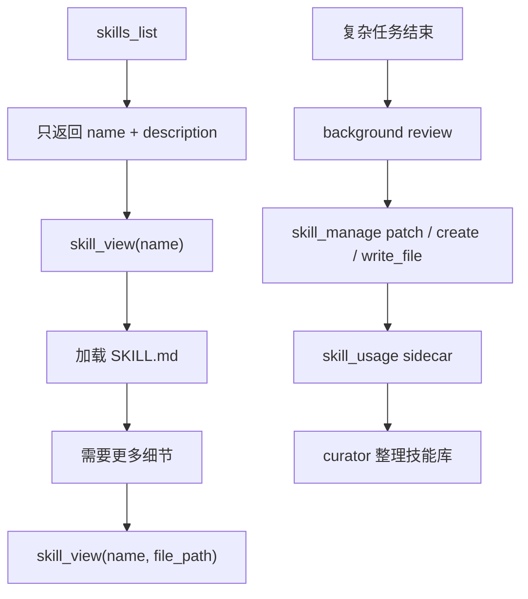

# Skills：把一次成功变成下次可复用的方法

Memory 记事实，Skills 记方法。

这句话是理解 Hermes 自进化的第二把钥匙。一个 Agent 如果只会把用户偏好写进 memory，它会变得更懂你，但不一定更会做事。要让它下次少踩坑，就需要把“这次怎么解决问题”沉淀成一套可复用流程。

Hermes 把这个流程叫 skill。

## Skill 到底是什么

在源码里，skill 不是抽象概念，而是一个目录：

```text
skills/
  my-skill/
    SKILL.md
    references/
    templates/
    scripts/
    assets/
```

`SKILL.md` 是主说明，`references/` 放细节材料，`templates/` 放可复制模板，`scripts/` 放可重复执行的脚本，`assets/` 放其他资源。

这个结构来自 [`tools/skills_tool.py`](https://github.com/NousResearch/hermes-agent/blob/3edd09a46/tools/skills_tool.py) 和 [`tools/skill_manager_tool.py`](https://github.com/NousResearch/hermes-agent/blob/3edd09a46/tools/skill_manager_tool.py)。后者开头就把 skills 定义成 procedural memory：它保存的是如何完成某类任务，而不是泛泛的知识。

换句话说，skill 不是“知识笔记”，而是“下次遇到同类任务时该怎么做”。

## 为什么不能把所有 skill 都塞进 prompt

一个自进化系统如果一直写 skill，很快会有几十、几百甚至更多技能。

如果每轮都把所有技能全文放进模型上下文，问题会立刻出现：

- prompt 变大，成本上升。
- 无关技能干扰当前任务。
- prompt cache 更难稳定。
- 模型可能混用多个技能里的流程。

Hermes 的解法是 progressive disclosure。

第一层是 `skills_list`。它只返回 name、description、category 等轻量元数据。模型先知道“有哪些能力可能有用”。

第二层是 `skill_view(name)`。只有确认某个 skill 相关时，才加载 `SKILL.md` 全文。

第三层是 `skill_view(name, file_path)`。如果 skill 下面还有 `references/`、`templates/`、`scripts/`，模型需要时再加载具体文件。

这个设计很像人读文档：先看目录，再打开章节，最后才进入附录。它让技能库可以增长，但每一轮模型只背当前任务需要的那一小部分。

## Skill 什么时候被创建

Hermes 不鼓励“一事一 skill”。

[`agent/background_review.py`](https://github.com/NousResearch/hermes-agent/blob/3edd09a46/agent/background_review.py) 里的 skills review prompt 对新 skill 的形状有明确倾向：class-level umbrella skill，而不是一次会话一个狭窄技能。

适合创建或更新 skill 的信号包括：

- 复杂任务成功完成，过程里有可复用步骤。
- 解决了一个棘手错误，背后有稳定排查方法。
- 用户纠正了某类任务的做法。
- 已加载的 skill 过期、缺步骤、写错了。
- 某个流程未来大概率还会出现。

不适合创建 skill 的情况：

- 一次性任务叙事。
- 临时环境缺包。
- 某次网络失败。
- 今天的具体 PR、issue、commit。
- 只对当前会话有意义的细节。

这里的判断和 memory 很像：要保存的是未来仍然有用的东西。

## skill_manage：让 Agent 能改自己的方法库

Hermes 通过 `skill_manage` 让 agent 管理 skill。

它支持这些动作：

- `create`：创建新 skill。
- `patch`：局部修改已有 skill。
- `edit`：重写 `SKILL.md`。
- `delete`：删除或归档 skill。
- `write_file`：写入支持文件。
- `remove_file`：移除支持文件。

源码在 [`tools/skill_manager_tool.py`](https://github.com/NousResearch/hermes-agent/blob/3edd09a46/tools/skill_manager_tool.py)。

一个关键细节是：`patch` 是首选修复方式，`edit` 只适合大改。因为 skill 是长期资产，越小的变更越容易审核，也越不容易把原本有用的流程覆盖掉。

另一个关键细节是：skill 写入也支持 write approval。skills 可能很大，无法像 memory 一样在聊天里轻松 inline 审核，所以开启审批后，skills 写入会进入 pending store。用户可以看 gist、diff，再决定 approve 或 reject。

## 后台 review 如何改 skill

自进化最有意思的部分在后台 review。

当前台任务完成后，如果 skill 计数达到阈值，`turn_finalizer` 会触发 background review。review fork 会读取本轮 transcript，判断是否应该写 skill。

它优先做几件事：

1. 如果当前会话加载过某个 skill，并且这个 skill 覆盖了新经验，优先 patch 它。
2. 如果没有加载过，但已有 umbrella skill 覆盖这个领域，patch 这个已有 skill。
3. 如果细节太长，写入 `references/`、`templates/` 或 `scripts/`，再在 `SKILL.md` 里加入口。
4. 如果没有任何 skill 覆盖这个任务类别，再创建新的 class-level skill。

这套顺序很重要。它避免技能库不断长出“某一次 bug 修复”“某一个 PR 审查”这种窄条目。Hermes 更希望形成少量更大的 umbrella skill，内部用章节和支持文件承载细节。

## skill_usage：自进化需要生命周期数据

当 skill 被查看、使用、修改时，Hermes 会更新 usage sidecar。源码在 [`tools/skill_usage.py`](https://github.com/NousResearch/hermes-agent/blob/3edd09a46/tools/skill_usage.py)。

这个 sidecar 记录：

- skill 是否是 agent-created。
- 最近使用时间。
- view_count、use_count、patch_count。
- 状态是 active、stale 还是 archived。
- 是否 pinned。

为什么不把这些信息写进 `SKILL.md` frontmatter？

因为 usage 是运行态数据，用户写的 skill 内容是知识资产。把二者混在一起，会制造冲突和噪声。Hermes 选择 sidecar，是为了让 telemetry 不污染 skill 本体。

## Curator：技能库也要整理

如果 agent 能自己创建 skill，就一定会遇到技能库膨胀。

今天一个“GitHub PR review 修复经验”，明天一个“PR review 评论处理经验”，后天一个“PR review CI 故障经验”，很快就会变成几十个看似不同、实际重叠的 skill。

Hermes 用 [`agent/curator.py`](https://github.com/NousResearch/hermes-agent/blob/3edd09a46/agent/curator.py) 做后台维护。

Curator 的职责包括：

- 根据活跃度把 skill 标为 stale。
- 长期不用的 skill 进入 archive，而不是直接删除。
- 只处理 agent-created skills。
- pinned skills 不自动迁移。
- 把过窄的 skill 合并进 umbrella skill。

这就是 Hermes 对“自进化”的第二个清醒点：增长本身不是价值，能被再次发现、再次使用、再次维护的增长才是价值。

## Skills 和 Memory 的区别再看一遍

把几个例子放在一起，会更清楚：

| 信息 | 应该去哪 | 原因 |
| --- | --- | --- |
| 用户讨厌冗长解释 | Memory + 相关 Skill | 这是用户偏好，也会影响某类任务怎么交付 |
| 某项目测试必须先启动依赖服务 | Memory | 稳定环境事实 |
| 做移动端视觉 QA 的步骤 | Skill | 可复用流程 |
| 某次截图里按钮溢出 | Transcript | 当前任务现场 |
| 某 provider 今天 500 了 | Transcript | 临时状态 |
| 某 provider 鉴权失败的排查路径 | Skill | 可复用调试方法 |

Memory 更像“事实卡片”，Skill 更像“操作手册”。一个自进化 agent 同时需要二者。

## 用源码串起来

Skills 的主路径可以这样看：



源码入口：

- 列表与加载：[`tools/skills_tool.py`](https://github.com/NousResearch/hermes-agent/blob/3edd09a46/tools/skills_tool.py)
- 创建与修改：[`tools/skill_manager_tool.py`](https://github.com/NousResearch/hermes-agent/blob/3edd09a46/tools/skill_manager_tool.py)
- 后台复盘：[`agent/background_review.py`](https://github.com/NousResearch/hermes-agent/blob/3edd09a46/agent/background_review.py)
- 使用侧数据：[`tools/skill_usage.py`](https://github.com/NousResearch/hermes-agent/blob/3edd09a46/tools/skill_usage.py)
- 生命周期整理：[`agent/curator.py`](https://github.com/NousResearch/hermes-agent/blob/3edd09a46/agent/curator.py)

## 这一篇怎么收束

可以这样表达：

Hermes 的 skills 是 procedural memory，用来保存“怎么做一类任务”。它用 progressive disclosure 控制上下文成本：`skills_list` 只暴露元数据，`skill_view` 按需加载全文，支持文件再通过 file_path 二次加载。任务结束后，background review 会根据复杂任务、用户纠正、技能缺陷等信号，用 `skill_manage` patch 或 create skill。为了防止技能库膨胀，Hermes 用 `skill_usage` 记录活跃度和来源，再由 curator 对 agent-created skills 做 stale、archive、consolidation。这样 skills 不是无限堆积的笔记，而是可维护的过程记忆库。

下一篇看 session_search。因为不是所有历史都该变成 memory 或 skill，但历史现场仍然要能找回来。
