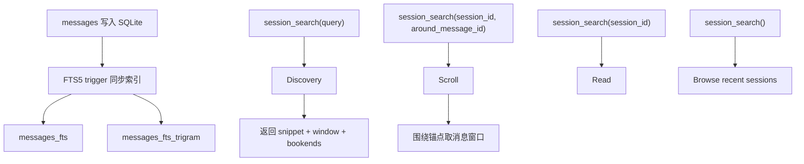

# Session Search：长期记忆不等于把历史全塞进上下文

如果 memory 和 skills 负责“沉淀”，那 session_search 负责“回忆”。

这两个词的差别很大。

沉淀意味着：某些东西已经被判断为长期有效，可以进入未来行为。回忆意味着：过去发生过一些事，现在可能有用，但只有在需要时才取出来。

Hermes 没有把历史会话全部塞进 prompt，而是把 transcript 落到 SQLite，再通过 `session_search` 按需取回。这是自进化闭环里很容易被低估的一环。

## 为什么不能把历史都放进 memory

很多人一看到“长期记忆”，第一反应就是：把过去对话总结一下，存起来，下次继续用。

问题是，历史里有大量不该长期注入的内容。

比如：

- 某个 bug 的临时报错。
- 一次失败的安装尝试。
- 当天的 PR 编号。
- 用户临时让 agent 采用的格式。
- 已经完成的任务进度。

这些信息未来可能会被问到，但它们不应该默认影响每一轮。

所以 Hermes 把“长期事实”和“历史现场”拆开：

- 长期事实进 memory。
- 可复用流程进 skill。
- 历史现场留 transcript，需要时 search。

这就是 session_search 的位置。

## session_search 的三种形态

[`tools/session_search_tool.py`](https://github.com/NousResearch/hermes-agent/blob/3edd09a46/tools/session_search_tool.py) 把工具设计成 single-shape，但会根据参数推断模式。

第一种是 discovery：传 `query`。

它会走 FTS5 全文搜索，返回命中的 session、snippet、命中附近的消息窗口，以及 session 开头和结尾的 bookends。这个形态适合回答“我之前是不是做过类似的事”。

第二种是 scroll：传 `session_id` + `around_message_id`。

它不会重新搜索，而是以某条消息为锚点，向前后取窗口。这个形态适合顺着一个旧现场继续往前后看。

第三种是 browse / read。

不传 query 时列最近会话；只传 `session_id` 时读取整个 session。这个形态适合用户明确指向某个历史会话。

这三个形态对应了真实回忆过程：先找线索，再沿着线索翻上下文，最后必要时读完整记录。

## SQLite + FTS5：为什么这里不需要 LLM

session_search 的核心不是“让模型总结历史”，而是先用数据库找真实消息。

[`hermes_state.py`](https://github.com/NousResearch/hermes-agent/blob/3edd09a46/hermes_state.py) 里有两张 FTS5 虚拟表：

- `messages_fts`：普通全文搜索。
- `messages_fts_trigram`：面向 CJK 等语言的 trigram 搜索。

每当 messages 表 insert、delete、update，触发器会同步更新 FTS 表。索引内容不仅包括 `content`，还包括 `tool_name` 和 `tool_calls`，所以工具调用相关内容也能被搜到。

这有两个好处。

第一，成本低。搜索阶段不需要额外 LLM 调用。

第二，证据更可靠。返回的是实际 transcript 里的消息，而不是先验总结。模型后续可以基于真实上下文判断，而不是读一段可能压缩失真的摘要。

## 为什么要有 CJK trigram

中文搜索很容易踩坑。

普通 tokenizer 可能把中文拆成单字，导致短语匹配不准。Hermes 额外建了 trigram FTS5 表，用重叠片段处理 CJK substring search。

这对中文用户很实际：搜索“大别山项目”时，用户想要的是这几个字连在一起出现的上下文，而不是“大”“别”“山”“项目”在同一段里松散出现。

这不是自进化的核心概念，但它说明 Hermes 的 session_search 不是随便包一层 grep，而是认真对待跨会话回忆的可用性。

## session lineage：压缩后历史还在

长期会话会触发上下文压缩。压缩后，模型继续工作的消息窗口变短，但原始 transcript 不应该消失。

Hermes 的 session 存储里有 parent / child lineage。压缩可以把后续工作切到 child session，但旧 session 仍然可搜索、可审计。

这对 session_search 很关键：即使当前模型视图只保留摘要和近期上下文，过去的真实消息仍然可以通过 session_search 找回。

换句话说，压缩解决“当前上下文怎么活下去”，session_search 解决“旧现场怎么回得来”。

## session_search 和 memory 的边界

可以用一个例子理解。

用户说：“还记得上次我们调那个 Telegram gateway 的问题吗？”

如果 Hermes 只靠 memory，它可能只记得“用户使用 Telegram gateway”。但这不足以恢复现场。

更好的路径是：

1. 用 session_search 搜 “Telegram gateway”。
2. 找到相关 session 和命中消息。
3. 用 scroll 继续看前后工具调用、错误、修复步骤。
4. 如果发现这次真的形成了可复用排查方法，再写成 skill。
5. 如果只是一次临时故障，就不要写 memory。

这就是 session_search 在闭环里的作用：它给后续判断提供证据，但不急着把证据变成长期事实。

## 用源码串起来

session_search 的主路径：

源码入口：

- 工具入口：[`tools/session_search_tool.py`](https://github.com/NousResearch/hermes-agent/blob/3edd09a46/tools/session_search_tool.py)
- SQLite session store：[`hermes_state.py`](https://github.com/NousResearch/hermes-agent/blob/3edd09a46/hermes_state.py)
- 系统层使用提醒：[`agent/prompt_builder.py`](https://github.com/NousResearch/hermes-agent/blob/3edd09a46/agent/prompt_builder.py)

## 这一篇怎么收束

可以这样表达：

Hermes 把历史回忆和长期记忆分开。memory 只保存稳定事实，skills 保存可复用流程，而完整 transcript 进入 SQLite session store。session_search 基于 FTS5 搜索历史消息，支持 query discovery、around-message scroll、recent browse 和 whole-session read。它返回真实消息窗口，不依赖 LLM 总结，因此成本低、证据强。CJK 查询走 trigram FTS5，压缩后的 session 通过 parent / child lineage 仍然可搜索。这样 Hermes 不需要把所有历史塞进 prompt，也能在需要时回到旧现场。

下一篇看运行时触发点。前面讲的是模块，现在要把它们串成一条真正会执行的链路。
