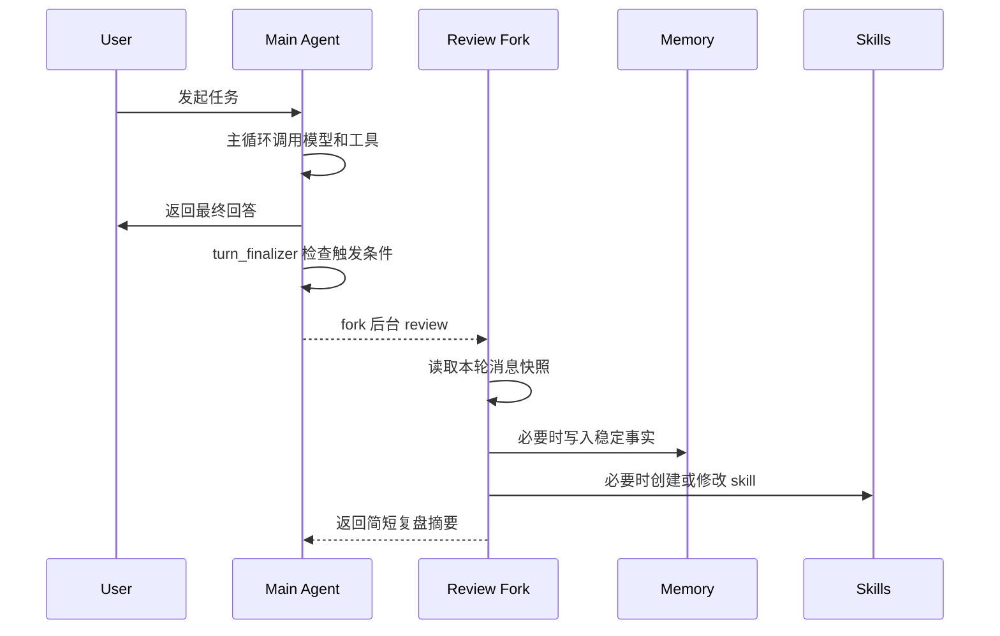

# 运行时触发点：自进化是怎么挂进主循环的

前面几篇分别看了 memory、skills、session_search。

但这些模块如果只是孤零零存在，还不能构成自进化。真正的问题是：它们在 Hermes 的一轮运行里，究竟什么时候出现？

这一篇沿着一次 `run_conversation` 的生命周期，把自进化链路串起来。

## 第一层：系统提示先划边界

自进化不是后台 review 才开始的。它从 system prompt 的行为边界就开始了。

[`agent/prompt_builder.py`](https://github.com/NousResearch/hermes-agent/blob/3edd09a46/agent/prompt_builder.py) 里有三段很关键的 guidance：

- `MEMORY_GUIDANCE`
- `SESSION_SEARCH_GUIDANCE`
- `SKILLS_GUIDANCE`

这三段告诉模型：

- 持久事实用 memory。
- 过去会话用 session_search 找。
- 复杂任务、棘手错误、可复用流程用 skill 保存。

它们的作用不是让模型“多写点东西”，而是让模型先学会分类。

如果没有这层边界，模型很容易把任务进度写进 memory，或者把一次性日志写成 skill。Hermes 的自进化从一开始就不是“保存一切”，而是“保存对的东西”。

## 第二层：memory 按用户 turn 触发

用户每发一轮消息，[`agent/turn_context.py`](https://github.com/NousResearch/hermes-agent/blob/3edd09a46/agent/turn_context.py) 会推进 `_turns_since_memory`。

逻辑很直接：

1. memory 开启。
2. memory 工具可用。
3. 当前 agent 有 memory store。
4. 用户 turn 计数达到 `_memory_nudge_interval`。
5. 设置 `should_review_memory = True`，并把计数归零。

默认 interval 是 10，初始化在 [`agent/agent_init.py`](https://github.com/NousResearch/hermes-agent/blob/3edd09a46/agent/agent_init.py)。

注意，这里只是“标记需要复盘”，不是立刻写 memory。真正写入会等到本轮任务结束后。

这样设计有两个原因：

- 当前用户任务优先，不能被复盘打断。
- 是否值得保存，要看完整轮次的最终结果。

## 第三层：skills 按工具迭代触发

Skill 的触发不是按用户 turn，而是按工具迭代。

原因很自然：skill 关注的是“怎么做事”。如果一轮任务用了很多工具、经历了多次修复、产生了复杂操作路径，那么它更可能值得沉淀成可复用流程。

在 [`agent/conversation_loop.py`](https://github.com/NousResearch/hermes-agent/blob/3edd09a46/agent/conversation_loop.py) 里，每次进入工具循环，Hermes 会推进 `_iters_since_skill`。如果中途真的调用了 `skill_manage`，这个计数会被重置，避免重复提醒。

本轮结束时，[`agent/turn_finalizer.py`](https://github.com/NousResearch/hermes-agent/blob/3edd09a46/agent/turn_finalizer.py) 会检查 `_iters_since_skill >= _skill_nudge_interval`。满足条件就设置 `_should_review_skills = True`，并把计数归零。

这让 Hermes 的 skill review 更贴近“复杂工作”而不是“聊天轮数”。

## 第四层：回答结束后才开后台 review

最终触发点仍然在 [`agent/turn_finalizer.py`](https://github.com/NousResearch/hermes-agent/blob/3edd09a46/agent/turn_finalizer.py)。

条件是：

- 有 `final_response`。
- 没有 interrupted。
- memory 或 skills 至少有一个需要 review。

满足后，Hermes 调用：

```text
agent._spawn_background_review(
  messages_snapshot=list(messages),
  review_memory=_should_review_memory,
  review_skills=_should_review_skills,
)
```

这一步说明 Hermes 把自进化设计成 side path，而不是 main path。

用户得到回答之后，后台再看这轮是否有东西值得保存。它失败了，也不会让主任务失败；它成功了，会给用户一个简短的 self-improvement review 摘要。

## 第五层：review fork 继承运行时，但限制工具

[`agent/background_review.py`](https://github.com/NousResearch/hermes-agent/blob/3edd09a46/agent/background_review.py) 会创建一个新的 `AIAgent`。

它继承父 agent 的：

- model
- provider
- api mode
- base_url
- api_key
- credential pool
- platform
- session id
- cached system prompt

同时，它会做几件限制：

- `max_iterations=16`
- `quiet_mode=True`
- `skip_memory=True`
- `_memory_nudge_interval = 0`
- `_skill_nudge_interval = 0`
- `compression_enabled = False`
- 只允许 memory 和 skills 工具

这几条限制非常关键。

`skip_memory=True` 是为了避免 review prompt 被外部 memory provider 吞进去，污染用户真实记忆空间。

`compression_enabled = False` 是为了避免 review fork 和前台 session 同时操作压缩 lineage，产生兄弟 child session。

工具 whitelist 是为了确保后台复盘只做经验保存，不会跑命令、改文件、触发别的外部副作用。

## 第六层：为什么要继承 cached system prompt

background review 继承父 agent 的 `_cached_system_prompt`。

这不是为了省几行初始化代码，而是为了保护 prompt cache。

如果 review fork 重新生成 system prompt，里面可能有新时间、新 session id、新工具集、新 skills snapshot。哪怕语义差不多，字节级前缀也会变化，缓存命中就会下降。

Hermes 选择继承父 agent 的 cached system prompt，让 review fork 尽量命中同一稳定前缀。

这说明 Hermes 的自进化不是“额外跑一个模型就完了”。它还要考虑成本、缓存、前缀稳定性、运行时一致性。

## 第七层：写入后不会立刻改当前模型视图

即使 background review 成功写入 memory，当前 session 的 system prompt snapshot 也不会立刻改变。

这和 memory 篇讲的一样：写入会落盘，但当前 session 的稳定前缀不动。

Skill 写入也会清理 skills system prompt cache，让后续需要重新构造技能摘要时能看到更新。但它不会把新 skill 全文硬塞进当前模型上下文。

所以完整链路是：



主路径和复盘路径分开，是 Hermes 运行时设计的核心。

## 失败时怎么办

background review 是 best-effort。

如果失败，Hermes 会记录 warning，并通过 auxiliary failure 机制报告，但不会让用户刚完成的任务回滚。

这个取舍很合理。因为自进化是增益能力，不应该反过来破坏任务完成。一个可靠的 agent 必须先完成当前任务，再考虑是否学习。

## 这一篇怎么收束

可以这样表达：

Hermes 的自进化挂在主循环之外，但由主循环触发。system prompt 先给模型 memory、session_search、skills 的分类边界。每个用户 turn 会推进 memory nudge counter，每次工具迭代会推进 skill nudge counter。任务结束后，turn_finalizer 判断本轮是否需要 review；如果需要，就 fork 一个后台 AIAgent，继承父 agent 的运行时和 cached system prompt，但禁用递归 nudge、禁用 compression，并用工具 whitelist 限制它只能调用 memory 和 skill 管理工具。这样自进化不会抢当前任务上下文，也不会破坏 prompt cache，同时把经验写入长期载体。

这段话能把宏观卖点落到具体源码：

- 分类边界：`prompt_builder.py`
- memory 计数：`turn_context.py`
- skill 计数：`conversation_loop.py`
- 触发后台 review：`turn_finalizer.py`
- review fork：`background_review.py`
- memory / skills 写入：`memory_tool.py`、`skill_manager_tool.py`

下一篇把这些内容收成一张总结地图：先讲清主线，再逐层展开到源码细节，并给出后续值得继续追问的问题。
