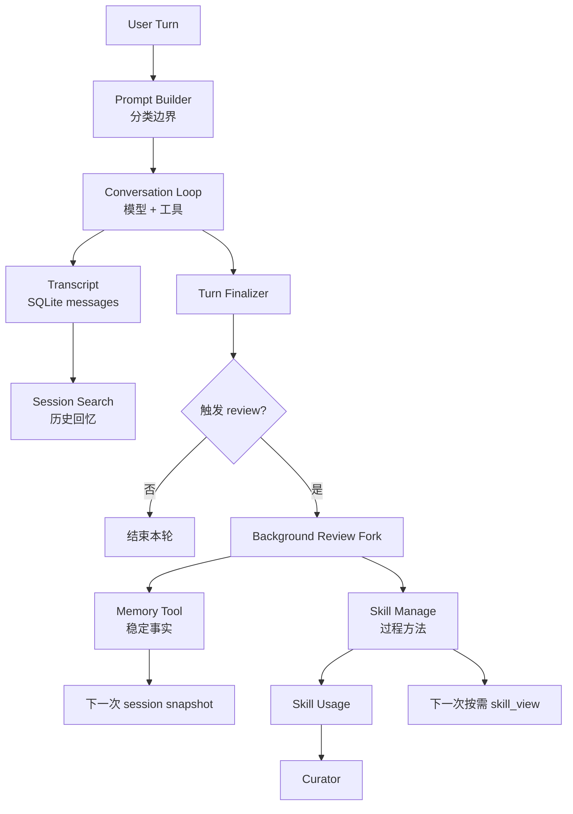

# 总结与追问：从宏观到微观讲清 Hermes Agent

读源码最怕两种结果。

一种是只记住文件名：`memory_tool.py`、`skills_tool.py`、`background_review.py`。回头想讲“这个系统解决什么问题”，却只能报目录。

另一种是只记住概念：自进化、长期记忆、技能系统。继续追问“它具体怎么触发”，又落不到源码。

这一篇把前面几篇收成一张总结地图：先用一段话讲清主线，再逐层展开，最后落到源码和后续追问。

## 一段话版本

Hermes Agent 的核心亮点是闭环学习。它不是只在当前上下文里调用工具，而是把一次任务产生的经验分成三类长期资产：稳定事实进入 memory，可复用流程进入 skills，完整历史进入 SQLite transcript 并通过 session_search 回忆。任务结束后，Hermes 会按 memory turn counter 和 skill tool-iteration counter 触发后台 review fork，让它只调用 memory 和 skill 管理工具来沉淀经验。写入可以走 approval gate，技能库还有 curator 做整理和归档，避免越学越乱。

这段话必须覆盖四个点：

- 它解决的是跨会话成长。
- 它不是一个 memory 就包打天下。
- 它的学习发生在后台 review，不抢主任务。
- 它有治理机制。

## 分层展开版本

可以分成五层讲。

第一层，运行目标。

Hermes 想做的是 self-improving agent。普通工具调用器只能完成当前任务，Hermes 进一步关心这次任务里的经验能否影响下一次任务。

第二层，经验分类。

Hermes 把经验分成三类。Memory 保存稳定事实，比如用户偏好和环境约定。Skills 保存过程方法，比如某类调试流程或审查清单。Session search 保存历史现场，通过 SQLite + FTS5 在需要时找回旧会话。

第三层，触发机制。

Memory review 按用户 turn 触发，默认 10 轮。Skill review 按工具迭代触发，默认 10 次。任务结束后，`turn_finalizer` 判断是否需要 review，再 fork 一个后台 agent。

第四层，后台复盘。

Review fork 继承父 agent 的 provider、model、credential、cached system prompt，保证运行时一致和 prompt cache 稳定。但它禁用递归 nudge、禁用 compression，并且只允许 memory 和 skills 工具。

第五层，治理。

Memory 有大小上限、threat scan、frozen snapshot、write approval。Skills 有 progressive disclosure、write approval、usage sidecar、curator。Curator 只处理 agent-created skills，做 stale、archive、consolidation，不直接删除。

这样讲完，读者能听到完整闭环，而不是零散功能。

## 源码展开版本

### 1. 起点：prompt_builder 给模型分工

[`agent/prompt_builder.py`](https://github.com/NousResearch/hermes-agent/blob/3edd09a46/agent/prompt_builder.py) 里有三类 guidance：

- memory 保存长期稳定事实。
- session_search 找过去会话。
- skill_manage 保存可复用流程。

这是自进化的语义边界。没有这层边界，agent 很容易把临时任务状态写进 memory，或者把一次性任务写成 skill。

### 2. Memory：短、稳、慢注入

[`tools/memory_tool.py`](https://github.com/NousResearch/hermes-agent/blob/3edd09a46/tools/memory_tool.py) 提供 `MemoryStore`。

它有两个文件：

- `MEMORY.md`：环境事实、项目约定、工具坑点。
- `USER.md`：用户画像、偏好、沟通方式。

启动时 `load_from_disk()` 读取文件，生成 frozen snapshot。中途 memory tool 写磁盘，但不改变当前 session 的 system prompt。这样可以保护 prompt cache，也避免本轮任务突然被新写入的长期事实影响。

Memory 还会做 threat scan、字符预算、文件锁、external drift 检测。它不是无限写，而是受限写。

### 3. Skills：过程记忆，不是知识堆

[`tools/skills_tool.py`](https://github.com/NousResearch/hermes-agent/blob/3edd09a46/tools/skills_tool.py) 负责列出和加载 skill。

它采用 progressive disclosure：

- `skills_list` 只给 name 和 description。
- `skill_view(name)` 加载 `SKILL.md`。
- `skill_view(name, file_path)` 再按需加载 references、templates、scripts。

[`tools/skill_manager_tool.py`](https://github.com/NousResearch/hermes-agent/blob/3edd09a46/tools/skill_manager_tool.py) 负责创建、修改、删除、写支持文件。它把 skill 定义成 procedural memory，也就是可复用操作方法。

这解释了为什么 Hermes 可以拥有很大的 skill library，却不会每轮都把所有技能塞进模型上下文。

### 4. Session Search：历史现场按需回忆

[`tools/session_search_tool.py`](https://github.com/NousResearch/hermes-agent/blob/3edd09a46/tools/session_search_tool.py) 负责历史回忆。

它有三种形态：

- discovery：用 query 搜历史。
- scroll：围绕某条 message id 继续看上下文。
- browse / read：列最近 session 或读取指定 session。

底层在 [`hermes_state.py`](https://github.com/NousResearch/hermes-agent/blob/3edd09a46/hermes_state.py)，用 SQLite + FTS5 建索引，并额外支持 CJK trigram。session_search 返回真实消息窗口，不需要先调用 LLM 总结历史。

### 5. Runtime：计数触发后台 review

初始化在 [`agent/agent_init.py`](https://github.com/NousResearch/hermes-agent/blob/3edd09a46/agent/agent_init.py)，默认：

- `_memory_nudge_interval = 10`
- `_skill_nudge_interval = 10`

用户 turn 进入 [`agent/turn_context.py`](https://github.com/NousResearch/hermes-agent/blob/3edd09a46/agent/turn_context.py)，推进 memory counter。

工具循环进入 [`agent/conversation_loop.py`](https://github.com/NousResearch/hermes-agent/blob/3edd09a46/agent/conversation_loop.py)，推进 skill counter。

本轮结束进入 [`agent/turn_finalizer.py`](https://github.com/NousResearch/hermes-agent/blob/3edd09a46/agent/turn_finalizer.py)，如果满足条件就 `_spawn_background_review()`。

后台 review 的主体在 [`agent/background_review.py`](https://github.com/NousResearch/hermes-agent/blob/3edd09a46/agent/background_review.py)。它 fork 一个新 `AIAgent`，继承父 agent 的运行时和 cached system prompt，但只允许 memory / skills 工具。

### 6. Governance：自进化不能失控

[`tools/write_approval.py`](https://github.com/NousResearch/hermes-agent/blob/3edd09a46/tools/write_approval.py) 给 memory 和 skills 写入加审批。

[`tools/skill_usage.py`](https://github.com/NousResearch/hermes-agent/blob/3edd09a46/tools/skill_usage.py) 用 sidecar 记录 skill 的使用、修改和来源。

[`agent/curator.py`](https://github.com/NousResearch/hermes-agent/blob/3edd09a46/agent/curator.py) 负责技能库整理。它只处理 agent-created skills，长期不用的标记 stale 或 archive，过窄的合并成 umbrella skill。archive 可恢复，不做不可逆删除。

这层治理是 Hermes 和“让模型随便写自己的记忆库”之间的差别。

## 常见追问

### 为什么 memory 和 session_search 要分开？

因为 memory 会进入未来模型视图，必须短、稳、可长期成立。session_search 是旧现场检索，适合保存任务过程、临时状态、历史证据。如果把 transcript 总结全塞进 memory，未来每一轮都会被过期信息污染。

### 为什么 skills 不直接全部放进 prompt？

因为 skill library 会增长。全部放进去会增加成本、干扰任务、破坏缓存。Hermes 用 `skills_list` / `skill_view` / linked files 三层加载，让模型只读取当前任务需要的技能。

### 为什么后台 review 要继承 cached system prompt？

为了 prompt cache。review fork 如果重新构造 system prompt，时间、session、工具集、skills snapshot 都可能抖动，缓存命中下降。继承父 agent 的 cached prompt 可以减少这类差异。

### 为什么 review fork 要限制工具？

后台复盘的目标是保存经验，不是执行新任务。限制到 memory 和 skills 工具，可以避免它在用户不关注时跑命令、改文件或触发外部副作用。

### 为什么需要 curator？

只要 agent 能写 skill，就会产生膨胀。Curator 通过 usage sidecar 识别 agent-created skills，把不用的归档，把过窄的合并，保持技能库可发现、可维护。

### Hermes 的自进化有什么局限？

它不是训练模型权重，也不是保证每次复盘都正确。它更像运行时层面的外部学习系统：把经验写进 memory、skills、transcript，并通过 review、approval、curator 让这些经验在未来更容易被用到。能力上限仍然受模型判断、写入质量和治理策略影响。

## 最后一张模块图

如果把这张图讲清楚，就已经能从宏观到微观介绍 Hermes Agent 的自进化机制。
